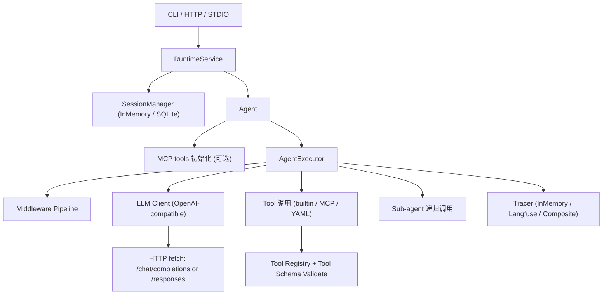

# NexAU-NodeJS

NexAU 的 Node.js/TypeScript 兼容重写版本。  
目标是保持与 Python 版运行行为兼容，同时提供更容易嵌入的 CLI / HTTP / STDIO 接口。

## 特性

- Node.js 22+，TypeScript 严格模式
- Agent 执行主循环：`LLM -> Tool -> LLM`
- 支持 `stop_tools`、重试、超时、中断信号、上下文压缩
- 支持子 Agent 调用（含递归深度保护）
- 内置文件 / Shell / Session / Web 工具
- 支持 MCP（HTTP 与 stdio）动态发现并注入工具
- 会话存储：内存模式 + SQLite 持久化
- 传输层：CLI、HTTP（含 SSE 流式事件）、STDIO（JSON Lines）
- Tracer：In-memory 与 Langfuse 适配器
- 跨框架 parity bench（Python baseline vs Node rewrite）

## 环境要求

- Node.js `>=22`
- pnpm `10.x`

## 安装与构建

```bash
pnpm install
pnpm build
```

## 快速开始

### 1) 新建最小 Agent 配置

`agent.yaml`：

```yaml
type: agent
name: demo_agent
system_prompt: You are a concise assistant.
tool_call_mode: openai
llm_config:
  model: gpt-4o-mini
  base_url: https://api.openai.com/v1
  api_key: ${env.OPENAI_API_KEY}
```

### 2) CLI 单轮模式

```bash
pnpm exec nexau chat -c ./agent.yaml -m "你好"
```

或直接用编译产物：

```bash
node dist/cli/main.js chat -c ./agent.yaml -m "你好"
```

### 3) CLI 交互模式

```bash
pnpm exec nexau chat -c ./agent.yaml
```

输入 `/exit` 或 `/quit` 退出。

### 4) 启动 HTTP 服务

```bash
pnpm exec nexau serve http -c ./agent.yaml --host 127.0.0.1 --port 8787
```

### 5) 启动 STDIO 服务

```bash
pnpm exec nexau serve stdio -c ./agent.yaml
```

## 示例资产（独立项目）

`NexAU-NodeJS` 已内置 Python 基线的 `examples/`，可在本仓库直接运行兼容示例，不依赖外部 `NexAU-latest` 目录。

核心示例：

- `examples/code_agent/code_agent.yaml`
- `examples/deep_research/deep_research_agent.yaml`
- `examples/nexau_building_team/leader_agent.yaml`

示例运行（CLI 单轮）：

```bash
pnpm exec nexau chat -c examples/code_agent/code_agent.yaml -m "请先读取当前目录结构"
```

## CLI 命令

### `chat`

```bash
pnpm exec nexau chat -c <config> [-m <message>] [--stream] [--user-id <id>] [--session-id <id>] [--session-db <path>]
```

- `-m/--message`：单轮模式；不传则进入交互模式
- `--stream`：输出执行事件流
- `--session-db`：启用 SQLite 会话持久化

### `serve http`

```bash
pnpm exec nexau serve http -c <config> [--host 127.0.0.1] [--port 8787] [--session-db <path>]
```

### `serve stdio`

```bash
pnpm exec nexau serve stdio -c <config> [--session-db <path>]
```

## HTTP API

默认由 `serve http` 启动。

### `GET /health`

返回：

```json
{ "status": "ok" }
```

### `GET /info`

返回运行时信息（agent 名称、工具数量、上下文限制等）。

### `POST /query`

请求体：

```json
{
  "input": "hello",
  "user_id": "u1",
  "session_id": "s1",
  "history": []
}
```

### `POST /stream`

同 `query` 入参，但返回 SSE：

- `run.started`
- `context.compacted`
- `llm.requested`
- `llm.responded`
- `tool.called`
- `tool.completed`
- `subagent.called`
- `subagent.completed`
- `run.completed` / `run.failed`
- `result`
- `end`

## STDIO 协议（JSON Lines）

每行一个 JSON 请求：

```json
{"id":"1","method":"health"}
{"id":"2","method":"info"}
{"id":"3","method":"query","params":{"input":"hello"}}
{"id":"4","method":"stream","params":{"input":"hello"}}
```

返回格式：

- `{"id":"...","type":"result","result":...}`
- `{"id":"...","type":"event","event":...}`（仅 `stream`）
- `{"id":"...","type":"error","error":{"message":"..."}}`

## 配置说明（Agent YAML）

核心字段（节选）：

- `name`、`description`
- `system_prompt` + `system_prompt_type` (`string|file|jinja`)
- `tools`（工具 YAML + binding）
- `skills`（技能目录，自动注入 `LoadSkill` 工具）
- `sub_agents`（递归加载）
- `llm_config`（模型与请求参数）
- `stop_tools`
- `middlewares`
- `mcp_servers`
- `tracers`
- `max_context_tokens`（默认 `128000`）
- `max_iterations`（默认 `100`）
- `retry_attempts`（默认 `5`）
- `timeout`（秒，默认 `300`）
- `tool_call_mode`：`xml | openai | anthropic`

### YAML 模板变量

支持：

- `${this_file_dir}`
- `${env.VAR_NAME}`
- `${variables.foo.bar}`（二次解析，且仅允许标量替换）

## LLM 配置与环境变量回退

`llm_config` 中未显式提供时，按以下优先组读取：

- `model`：`MODEL` / `OPENAI_MODEL` / `LLM_MODEL`
- `base_url`：`OPENAI_BASE_URL` / `BASE_URL` / `LLM_BASE_URL`
- `api_key`：`LLM_API_KEY` / `OPENAI_API_KEY` / `API_KEY` / `ANTHROPIC_API_KEY`

支持两种 API 形态：

- `api_type: openai_chat_completion`（默认）
- `api_type: openai_responses`

## 内置工具

按工具名/绑定可解析到实现：

- 文件类：`read_file` / `write_file` / `replace` / `list_directory` / `glob` / `search_file_content` / `read_many_files`
- 文件增强：`apply_patch` / `read_visual_file`
- Shell：`run_shell_command`
- Session：`save_memory` / `write_todos` / `ask_user` / `complete_task`
- Web：`web_search` / `web_read` / `WebSearch` / `WebRead` / `WebFetch`
- 兼容别名：`Bash` / `TodoWrite` / `Write`

说明：

- `web_search` 当前为 stub（返回空结果集）
- `web_fetch` 会抓取网页并返回去标签后的文本摘要
- `BackgroundTaskManage` 当前为未实现占位
- `read_visual_file` 当前支持图片读取（base64 data URL）；视频输入返回兼容元信息占位
- `apply_patch` 支持 Codex 风格 `*** Begin Patch`/`*** End Patch` 增删改与 move

## 会话与持久化

- 默认：`InMemorySessionManager`
- 启用持久化：通过 `--session-db <path>` 使用 `SqliteSessionManager`
- 会话键维度：`user_id + session_id + agent_id`
- `agent_id` 使用配置指纹（`name#hash`），避免同名不同配置串话
- 兼容旧数据：若新键无状态，会回退读取 legacy 键并迁移

## MCP 支持

`mcp_servers` 支持：

- HTTP JSON-RPC
- stdio（`Content-Length` framed JSON-RPC）

启动时会执行工具发现，并把 MCP 工具注入为本地工具名：

`mcp__<server_name>__<tool_name>`

## Middleware 与 Tracer

### Middleware

- 内置识别 `LoggingMiddleware` 变体（写入 `agentState` 日志）
- 未识别中间件按 pass-through 处理（保证旧 YAML 可运行）

### Tracer

- `InMemoryTracer`
- `LangfuseTracer`（向 `/api/public/ingestion` 上报）
- 多 tracer 自动组合为 `CompositeTracer`

## 开发命令

```bash
pnpm build
pnpm format
pnpm format:check
pnpm lint
pnpm typecheck
pnpm test
pnpm check
```

跨框架 parity：

```bash
pnpm parity:cross
pnpm parity:cross:check
pnpm parity:assets
pnpm parity:assets:check
pnpm parity:all
pnpm parity:all:check
pnpm parity:all:failures
pnpm parity:all:diagnose
pnpm parity:all:triage
```

默认输出到临时目录（命令 stdout 会返回路径）。
如需落盘到仓库目录，使用：

```bash
python3 compat/parity/cross-framework/run_compare.py --output-dir compat/parity/cross-framework/results
```

当前 parity gate 除了 prompt payload 一致外，还会检查：

- 工具调用的一致性（名称顺序 + tool_call_id + 参数）
- 最终输出一致性
- 长上下文压缩中的 compaction 次数与最终消息数 delta
- `examples/` 结构化资产（`yaml/yml/json`）语义一致性（缺失/语义差异 gate）
- 可选：非结构化资产严格门禁（全部严格或按路径前缀严格）

统一汇总报告（runtime + assets）由 `parity:all` 生成，默认输出临时目录并返回路径。
报告会同时输出 runtime 场景级摘要表和 asset 差异分类摘要，便于快速定位偏差来源。
当 CI 失败时，优先使用 `parity:all:failures` 获取失败优先摘要（仅失败项）。
随后运行 `parity:all:diagnose`，可直接拿到 `failure_highlights` 与对应 runtime/asset 明细片段。
若只需要关键字段，可直接用 `parity:all:triage`（一条命令，无需 jq）。

## 项目结构

```text
src/
  cli/          # commander 命令入口
  core/         # AgentConfig / LLMConfig / Executor
  tool/         # Tool 抽象、内置工具、MCP 客户端
  transport/    # RuntimeService + HTTP/STDIO 服务
  session/      # 内存与 SQLite 会话管理
  tracer/       # tracing 抽象与适配器
  compat/       # YAML 变量兼容层
docs/           # 兼容矩阵、差异说明、集成案例
compat/parity/  # 跨框架基准、fixture、报告
```

## 项目结构与功能依赖（详细）

### 1) 分层与调用链



请求路径统一为：

1. 入口层（CLI/HTTP/STDIO）把请求规范化为 `RuntimeRequest`
2. `RuntimeService` 读取/更新会话状态（history + agentState）
3. `Agent` 确保 MCP 工具注入完成后调用 `AgentExecutor`
4. `AgentExecutor` 执行 `LLM -> Tool -> LLM` 迭代直到完成、停止或失败
5. 结果写回会话存储，并返回标准化响应

### 2) 核心模块依赖关系

| 模块                             | 主要职责                                                  | 直接依赖                                             | 被谁依赖              |
| -------------------------------- | --------------------------------------------------------- | ---------------------------------------------------- | --------------------- |
| `src/cli`                        | 命令行参数解析与子命令分发                                | `core`, `transport`, `session`                       | 用户入口              |
| `src/transport`                  | HTTP/STDIO 协议适配与运行时封装                           | `core`, `session`                                    | `cli`、外部服务       |
| `src/core/agent-config.ts`       | YAML 配置解析、校验、默认值、子 agent/skill/tool 组装     | `compat/yaml-loader`, `tool/tool`, `llm-config`      | `cli`, `Agent`, 测试  |
| `src/core/agent.ts`              | Agent 运行门面，MCP 工具延迟注入                          | `core/execution/executor`, `tool/builtin/mcp-client` | `RuntimeService`      |
| `src/core/execution`             | 执行主循环、中断、重试、超时、上下文压缩、并发工具调用    | `tool`, `tracer`                                     | `Agent`               |
| `src/tool/tool.ts`               | Tool 抽象、JSON Schema 校验、执行错误统一包装             | `ajv`, `yaml`, `registry`                            | `core`, `mcp-client`  |
| `src/tool/registry.ts`           | binding/tool-name 到实现函数映射                          | `tool/builtin/*`                                     | `Tool`                |
| `src/tool/builtin/mcp-client.ts` | MCP server 发现工具并封装为本地 `Tool`                    | `tool/tool`, `fetch`, `child_process`                | `Agent`               |
| `src/session`                    | 会话状态存取（内存/SQLite）                               | `node:sqlite`（SQLite 实现）                         | `RuntimeService`, CLI |
| `src/tracer`                     | 追踪抽象、路由与适配器组合                                | `fetch`（Langfuse）                                  | `AgentExecutor`       |
| `src/compat`                     | `${env.*}`、`${variables.*}`、`${this_file_dir}` 模板替换 | `yaml`                                               | `AgentConfig`         |

### 3) 功能依赖矩阵

| 功能                  | 关键内部依赖                                            | 外部依赖/协议                        | 关键配置字段                              |
| --------------------- | ------------------------------------------------------- | ------------------------------------ | ----------------------------------------- |
| 聊天执行（单轮/多轮） | `RuntimeService`, `Agent`, `AgentExecutor`              | OpenAI-compatible HTTP API           | `llm_config`, `max_iterations`, `timeout` |
| 工具调用（本地）      | `Tool`, `registry`, `tool/builtin/*`                    | JSON Schema Draft-07                 | `tools[].yaml_path`, `tools[].binding`    |
| 工具并发执行          | `AgentExecutor` 并发分支                                | Node Promise 调度                    | `disable_parallel`, `stop_tools`          |
| 子 Agent 协作         | `AgentConfig.sub_agents`, `AgentExecutor`               | 递归调用                             | `sub_agents`, `max_running_subagents`     |
| 长上下文压缩          | `AgentExecutor` + middleware 参数解析                   | 内部 token 估算策略                  | `max_context_tokens`, `middlewares`       |
| 会话持久化            | `RuntimeService` + `SqliteSessionManager`               | SQLite WAL                           | `--session-db`, `user_id/session_id`      |
| MCP 工具接入          | `initializeMcpTools`, `McpHttpClient`, `McpStdioClient` | MCP JSON-RPC（HTTP / stdio framing） | `mcp_servers`                             |
| 可观测性追踪          | `resolveTracer`, `LangfuseTracer`, `CompositeTracer`    | Langfuse ingestion API               | `tracers`, `LANGFUSE_*`                   |
| HTTP 服务             | `transport/http/server.ts`                              | REST + SSE                           | `serve http` 参数                         |
| STDIO 服务            | `transport/stdio/server.ts`                             | JSON Lines                           | `serve stdio` 参数                        |

### 4) 第三方库依赖（按用途）

| 依赖          | 用途                                 | 使用位置                                                                    |
| ------------- | ------------------------------------ | --------------------------------------------------------------------------- |
| `commander`   | CLI 命令定义与参数解析               | `src/cli/main.ts`                                                           |
| `yaml`        | 解析 agent/tool YAML                 | `src/core/agent-config.ts`, `src/tool/tool.ts`, `src/compat/yaml-loader.ts` |
| `zod`         | Agent 配置结构校验                   | `src/core/agent-config.ts`                                                  |
| `ajv`         | Tool `input_schema` JSON Schema 校验 | `src/tool/tool.ts`                                                          |
| `minimatch`   | 文件 glob / include / ignore 匹配    | `src/tool/builtin/file-tools.ts`                                            |
| `node:sqlite` | SQLite 会话持久化                    | `src/session/sqlite-session-manager.ts`                                     |

### 5) 改动影响面参考

| 你要改的目标        | 首先关注的目录                                                                  |
| ------------------- | ------------------------------------------------------------------------------- |
| 新增 CLI 子命令     | `src/cli/main.ts`, `src/cli/commands/*`                                         |
| 新增/修改运行时协议 | `src/transport/http`, `src/transport/stdio`, `src/transport/runtime-service.ts` |
| 调整 Agent 执行行为 | `src/core/execution/executor.ts`, `src/core/execution/middleware.ts`            |
| 扩展配置字段        | `src/core/agent-config.ts` + 对应测试                                           |
| 新增内置工具        | `src/tool/builtin/*`, `src/tool/registry.ts`                                    |
| 接入新 tracer       | `src/tracer/resolve.ts`, `src/tracer/adapters/*`                                |
| 会话模型变更        | `src/session/*`, `src/transport/runtime-service.ts`                             |
| 兼容性回归验证      | `compat/parity/*`, `docs/compat-*.md`                                           |

## 兼容性文档

- `docs/compat-matrix.md`
- `docs/compat-differences.md`
- `docs/integration-cases.md`
